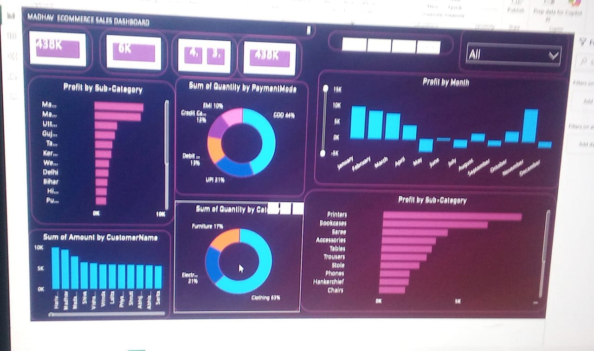

# my-first-project
#  Ecommerce Sales Dashboard Analysis using Power BI

##  Project Overview
This project analyzes ecommerce sales data using Power BI and provides interactive visualizations to track sales performance, profit trends, customer behavior, product categories, and payment methods.

## Business Objectives
- Monitor overall sales and profit performance
- Identify top-performing customers
- Analyze category and sub-category profitability
- Track monthly profit trends
- Understand customer payment preferences

##  Tools & Technologies
- Power BI
- Microsoft Excel / CSV
- Data Cleaning
- Data Visualization
- Business Intelligence

##  Dataset Files
- `MADHAV_SALES.pbix` – Power BI Dashboard
- `Orders.csv` – Orders Dataset
- `Details.csv` – Product Details Dataset
- `sales.jpeg` – Dashboard Screenshot

## 📈 Key Insights
- Total Sales: **438K**
- Highest Sales Category: **Clothing (63%)**
- Most Used Payment Mode: **Cash on Delivery (44%)**
- Highest Profit Months: **January & December**
- Top Customers contributed significantly to revenue growth

## Dashboard Preview

##  Dashboard Features
✔ Sales Performance Analysis  
✔ Monthly Profit Tracking  
✔ Customer Analysis  
✔ Product Category Analysis  
✔ Payment Mode Analysis  
✔ Interactive Filters & Visualizations  

##  Author
**Aditi Maurya**

### Connect With Me
- GitHub: Your GitHhttps://github.com/aditimaurya247-sketch/my-first-projectub Profile Link
- LinkedIn: Your LinkedInhttps://www.linkedin.com/in/aditi-maurya-b4289b376 Profile Link

---
 If you found this project useful, feel free to star this repository.
